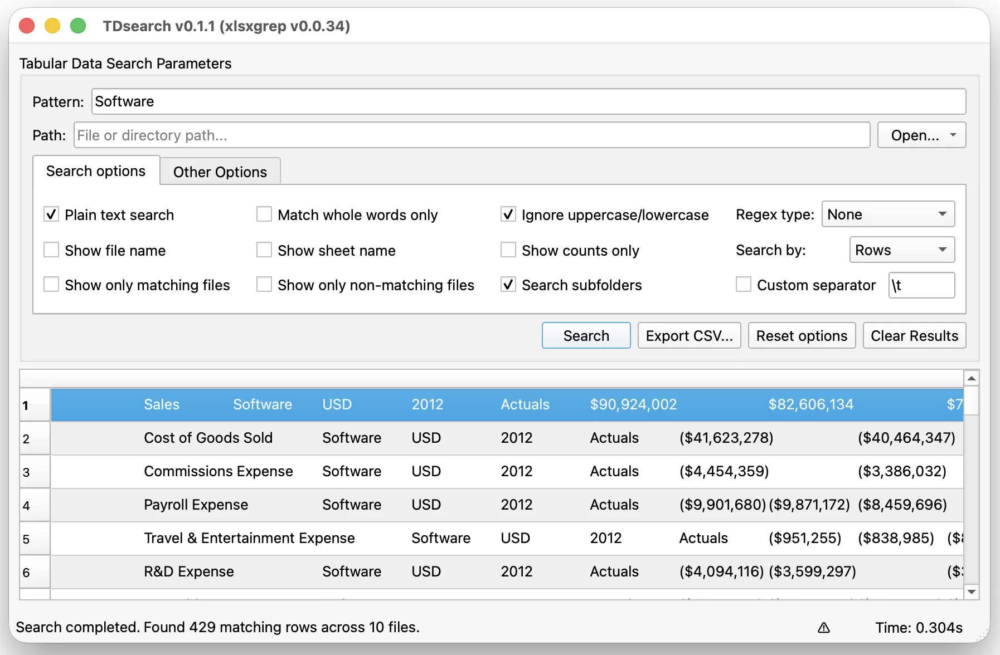

# TDsearch (Tabular Data Search)

**TDsearch** is a desktop GUI application designed to search text across spreadsheet files including XLSX, XLS, XLSM, CSV, TSV, and ODS formats.

<p align="center">
	
</p>

## Features
- **GUI Interface:** Modern PySide6 interface with file and folder browsers.
- **Multiprocessing Support:** Multi-core parallel search execution.
- **Regex Support:** Python regex and POSIX Extended Regular Expressions (-E).
- **Search Options:** Ignore case (-i), fixed strings (-F), word match (-w), column search mode.
- **CSV Export:** Export structured search results directly to CSV.

## Installation
```sh
pip install tdsearch
```

## Launch
```sh
tdsearch
```

## Standalone installers

...will follow soon
